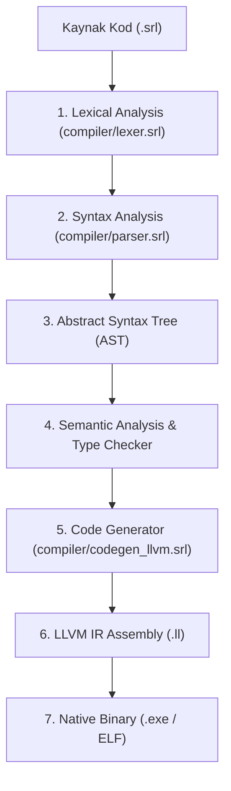
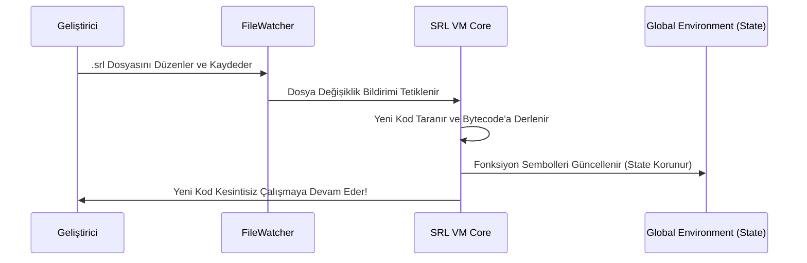

# SRL (Serial Run Language) - Kapsamlı Mimari ve Teknik Şartname El Kitabı (v0.2.0 Specification)

**Sürüm:** `v0.2.0`  
**Lisans:** GNU General Public License v3.0 (GPLv3)  
**Çalışma Modeli:** C++ Bytecode VM (Interpreter/Hot-Reload) & Öz-Derlemeli LLVM IR Derleyicisi (`compiler/srlc.srl`)  
**Tasarım Amacı:** Yüksek performanslı dijital sinyal işleme (DSP), gerçek zamanlı ses/FFT analizi, masaüstü Qt GUI uygulamaları, canlı koda müdahale (Live Hot-Reloading) ve bağımsız makine kodu (native executable) üretimi.

---

## 📑 İçindekiler
1. [Giriş ve Mimari Felsefe](#1-giriş-ve-mimari-felsefe)
2. [Sanal Makine (VM) Bytecode Komut Seti Tablosu](#2-sanal-makine-vm-bytecode-komut-seti-tablosu)
3. [Derleyici Derleme Boru Hattı (Compiler Pipeline)](#3-derleyici-derleme-boru-hattı-compiler-pipeline)
4. [Canlı Koda Müdahale (Hot-Reloading) İç Mekanizması](#4-canlı-koda-müdahale-hot-reloading-i̇ç-mekanizması)
5. [Bellek Yönetimi ve Referans Sayma (ARC) Modeli](#5-bellek-yönetimi-ve-referans-sayma-arc-modeli)
6. [Hata Yakalama Mekanizması (`try` / `catch` / `throw`)](#6-hata-yakalama-mekanizması-try--catch--throw)
7. [Gelişmiş Dil Özellikleri: `const`, `enum`, `export` ve Tip Etiketleri](#7-gelişmiş-dil-özellikleri-const-enum-export-ve-tip-etiketleri)
8. [Eşzamanlılık ve Senkronizasyon (Async/Await, Mutex, Channel)](#8-eşzamanlılık-ve-senkronizasyon-asyncawait-mutex-channel)
9. [Gelişmiş Koleksiyonlar (`std/collections.srl`)](#9-gelişmiş-koleksiyonlar-stdcollectionssrl)
10. [Qt Masaüstü GUI Çerçevesi (`std/qt.srl`)](#10-qt-masaüstü-gui-çerçevesi-stdqtsrl)
11. [FFI Engine ve C Kütüphane Entegrasyonu](#11-ffi-engine-ve-c-kütüphane-entegrasyonu)
12. [Dijital Sinyal İşleme (DSP) & FFT Motoru](#12-dijital-sinyal-işleme-dsp--fft-motoru)
13. [Paket Yöneticisi ve CLI Araç Takımı Kılavuzu](#13-paket-yöneticisi-ve-cli-araç-takımı-kılavuzu)

---

## 1. Giriş ve Mimari Felsefe

**SRL (Serial Run Language)**, donanım yakınlığındaki düşük seviyeli sistem dili performansını (C/C++), esnek dinamik prototip kalıtımı (Lua) ve modern masaüstü arayüz (Qt GUI) yetenekleriyle buluşturan hibrit bir sistem diller grubudur.

### Temel Sistem Özellikleri:
- **Çift Çalıştırma Katmanı:** VM ile çalışma anında anlık kod müdahalesi (Hot-Reloading) yapabilir veya `srlc.srl` ile LLVM IR üzerinden x86_64 bağımsız `.exe` ikili dosyasına derlenebilir.
- **Sıfır-Kesinti Hot-Reloading:** Uygulama durdurulmadan bellekteki değişken durumları (state) korunarak kod anında güncellenir.
- **Qt Masaüstü GUI & QML Desteği:** Yerel Qt Widgets pencereleri, butonları ve layout'ları yönetimi.

---

## 2. Sanal Makine (VM) Bytecode Komut Seti Tablosu

SRL Sanal Makinesi (VM) yığıt tabanlı (stack-based) bir mimariye sahiptir. Her OpCode 8-bitlik komut baytı ile temsil edilir:

| OpCode (Bayt Değeri) | Komut Adı | Yığıt (Stack) Etkisi | Açıklama |
| :--- | :--- | :--- | :--- |
| `0x00` | `OP_CONSTANT` | `-> [val]` | Sabit havuzundan sabit değeri yığıta yükler. |
| `0x01` | `OP_NIL` | `-> [nil]` | Yığıta `nil` değeri atar. |
| `0x02` | `OP_TRUE` | `-> [true]` | Yığıta `true` mantıksal değerini atar. |
| `0x03` | `OP_FALSE` | `-> [false]` | Yığıta `false` mantıksal değerini atar. |
| `0x04` | `OP_POP` | `[val] ->` | Yığıtın en üstündeki elemanı çıkarır. |
| `0x05` | `OP_DEFINE_GLOBAL` | `[val] ->` | Global sembol tablosunda yeni değişken tanımlar. |
| `0x06` | `OP_GET_GLOBAL` | `-> [val]` | Global sembol tablosundan değişken değerini okur. |
| `0x07` | `OP_SET_GLOBAL` | `[val] -> [val]` | Global değişkene yeni değer atar. |
| `0x08` | `OP_GET_LOCAL` | `-> [val]` | Aktif CallFrame yığıt offset'indeki yerel değişkeni okur. |
| `0x09` | `OP_SET_LOCAL` | `[val] -> [val]` | Aktif CallFrame yığıt offset'indeki yerel değişkene yazar. |
| `0x0A` | `OP_EQUAL` | `[b, a] -> [a == b]` | İki değerin eşitliğini karşılaştırır. |
| `0x0B` | `OP_GREATER` | `[b, a] -> [a > b]` | Büyüktür karşılaştırması yapar. |
| `0x0C` | `OP_LESS` | `[b, a] -> [a < b]` | Küçüktür karşılaştırması yapar. |
| `0x0D` | `OP_ADD` | `[b, a] -> [a + b]` | Sayısal toplama veya metin birleştirme yapar. |
| `0x0E` | `OP_SUBTRACT` | `[b, a] -> [a - b]` | Çıkarma işlemi yapar. |
| `0x0F` | `OP_MULTIPLY` | `[b, a] -> [a * b]` | Çarpma işlemi yapar. |
| `0x10` | `OP_DIVIDE` | `[b, a] -> [a / b]` | Bölme işlemi yapar (Sıfıra bölme kontrolü ile). |
| `0x11` | `OP_MODULO` | `[b, a] -> [a % b]` | Mod alma işlemi yapar. |
| `0x12` | `OP_NOT` | `[val] -> [!val]` | Mantıksal değilini alır. |
| `0x13` | `OP_NEGATE` | `[val] -> [-val]` | Sayısal işaretini tersine çevirir. |
| `0x14` | `OP_JUMP` | `[no-change]` | Belirtilen ip offset'ine kartsız atlar. |
| `0x15` | `OP_JUMP_IF_FALSE` | `[cond]` | Yığıt en üstü yanlışsa belirtilen ip offset'ine atlar. |
| `0x16` | `OP_LOOP` | `[no-change]` | Döngü başlangıcına geri atlar (Backwards jump). |
| `0x17` | `OP_CALL` | `[fn, args...] -> [res]` | Fonksiyonu çağırır ve yeni CallFrame oluşturur. |
| `0x18` | `OP_RETURN` | `[res] -> [res]` | Aktif CallFrame'den çıkıp sonucu geri döner. |

---

## 3. Derleyici Derleme Boru Hattı (Compiler Pipeline)

SRL öz-derlemeli derleyicisi (`compiler/srlc.srl`) kaynak koddan makine koduna dönüşümü 6 aşamada gerçekleştirir:



1. **Lexical Analysis (Lexer):** `.srl` kaynak metnini tarayarak anlamsal token dizilerine (`TOKEN_VAR`, `TOKEN_FN`, `TOKEN_NUMBER` vb.) böler.
2. **Syntax Analysis (Parser):** Token akışını özyinelemeli inen (recursive-descent) yöntemle ayrıştırarak AST düğümleri (`VAR_DECL`, `FN_DECL`, `IF_STMT`) oluşturur.
3. **Semantic Analysis:** Sembol tablolarını (Symbol Table) ve değişken tiplerini doğrular.
4. **LLVM IR Code Generation:** AST düğümlerini doğrudan x86_64 mimarisine uyumlu LLVM IR (`.ll`) metnine çevirir.
5. **Native Linker:** `clang` / LLVM araç takımı ile bağlayarak doğrudan müstakil `.exe` oluşturur.

---

## 4. Canlı Koda Müdahale (Hot-Reloading) İç Mekanizması

SRL VM'in en güçlü özelliklerinden biri uygulama çalışırken koda müdahale edilmesidir (`srl watch script.srl`).



### State Koruma İlkesi:
- **Global Sembol Tablosu (`Environment`):** Bellekteki `var` değişken değerleri, haritalar ve veri yapıları sıfırlanmaz.
- **Dinamik Fonksiyon Güncellemesi:** Çağrılan fonksiyon isimleri çalışma anında `Env` üzerinden en güncel bytecode adresine bağlanır (`HOT RELOAD MAGIC`).

---

## 5. Bellek Yönetimi ve Referans Sayma (ARC) Modeli

SRL'de nesneler, haritalar ve dinamik diziler Otomatik Referans Sayma (Automatic Reference Counting - ARC) ile yönetilir:

- **Çöp Toplama Duraklaması Yok:** Manuel `free()` gerektirmez, referans sayısı 0'a düştüğü anda nesne belleği derhal serbest bırakılır.
- **Değer Kopyalama ve Paylaşım:** İlkel tipler (`NUMBER`, `BOOL`) değer olarak aktarılırken, `MAP` ve `ARRAY` referans olarak paylaşılır.

---

## 6. Hata Yakalama Mekanizması (`try` / `catch` / `throw`)

Çalışma zamanı hatalarını ve özel istisnaları kontrol altına almak için `try`, `catch` ve `throw` blokları kullanılır:

```srl
fn veritabani_oku(dosya_yolu) {
    if dosya_yolu == "" {
        throw "Geçersiz dosya yolu hatası!";
    }
    return "Veri Okundu";
}

try {
    var veri = veritabani_oku("");
    print(veri);
} catch err {
    print("⚠️ Hata Yakalandı: " + to_string(err));
}
```

---

## 7. Gelişmiş Dil Özellikleri: `const`, `enum`, `export` ve Tip Etiketleri

### A. Sabitler (`const`):
```srl
const MAX_BAGLANTI = 100;
const PI = 3.14159265;
```

### B. Numaralandırmalar (`enum`):
```srl
enum SesModu {
    MONO,
    STEREO,
    SURROUND
}

var mod = SesModu["STEREO"];
print("Seçilen Ses Modu: " + to_string(mod));
```

### C. İsteğe Bağlı Tip Etiketleri (Type Annotations):
```srl
var frekans: number = 440;
var kanal_adi: string = "Sol Kanal";

fn topla(a: number, b: number): number {
    return a + b;
}
```

---

## 8. Eşzamanlılık ve Senkronizasyon (Async/Await, Mutex, Channel)

### A. Async / Await İstemleri:
```srl
async fn veri_indir(url) {
    var veri = net_http_get(url);
    return veri;
}

// Asenkron Çağrı
var async_gorev = await veri_indir("http://api.example.com/data");
```

### B. Mutex & Channel Senkronizasyonu (`std/sync.srl`):
```srl
import("std/sync.srl");

var kilit = mutex_create();
var kanal = channel_create();

// İş parçacığı güvenli veri iletimi
mutex_lock(kilit);
channel_send(kanal, "Korumalı Veri");
mutex_unlock(kilit);

var gelen = channel_recv(kanal);
print("Kanal Gelen: " + to_string(gelen));
```

---

## 9. Gelişmiş Koleksiyonlar (`std/collections.srl`)

Standard kütüphanede performanslı veri yapıları sunulur:

```srl
import("std/collections.srl");

// 1. Set (Benzersiz Küme)
var s = set_new();
set_add(s, "elma");
set_add(s, "elma"); // Tekrarlanan eklenmez

// 2. Queue (FIFO Sıra)
var q = queue_new();
queue_push(q, "Görev 1");
queue_push(q, "Görev 2");
var g = queue_pop(q); // "Görev 1"

// 3. RingBuffer (Dairesel Arabellek - Ses/DSP için)
var rb = ringbuffer_new(1024);
ringbuffer_write(rb, 440.0);
```

---

## 10. Qt Masaüstü GUI Çerçevesi (`std/qt.srl`)

SRL yerel **Qt Widgets** masaüstü uygulamaları geliştirmek için yüksek seviyeli `std/qt.srl` modülü içerir:

```srl
import("std/qt.srl");

// 1. Qt Uygulamasını Başlatırma
qt_app_init();

// 2. Pencere Oluşturma
var win = qt_window("SRL Qt Masaüstü Uygulaması", 400, 300);

// 3. Arayüz Elemanları
var lbl = qt_label(win, "SRL Dili ile Qt Arayüzü!");
var btn = qt_button(win, "Tıkla!", fn() {
    qt_msgbox("Bilgi", "Butona SRL içerisinden tıklandı!");
});

// 4. Dikey Layout Yerleşimi
var layout = qt_layout(win, "VERTICAL");
qt_layout_add(layout, lbl);
qt_layout_add(layout, btn);

// 5. Uygulamayı Çalıştırma
qt_exec();
```

---

## 11. FFI Engine ve C Kütüphane Entegrasyonu

SRL dinamik C kütüphanelerine (`.dll` / `.so`) doğrudan erişim FFI motoru sağlar:

```srl
// Windows User32.dll kütüphanesini bağlama
var handle = ffi_load("user32.dll");

if handle > 0 {
    print("user32.dll başarıyla yüklendi. Handle: " + to_string(handle));
    ffi_free(handle);
}
```

---

## 12. Dijital Sinyal İşleme (DSP) & FFT Motoru

```srl
var sample_rate = 8000;
var signal = dsp_sine(440, sample_rate, 64);

// Terminal ASCII Plot
dsp_plot(signal, 8, "440Hz Sinyal");

// Fast Fourier Transform
var fft = dsp_fft(signal);
var mag = dsp_magnitude(fft["real"], fft["imag"]);
dsp_plot(mag, 8, "Spektrum Genliği");
```

---

## 13. Paket Yöneticisi ve CLI Araç Takımı Kılavuzu

```bash
# Script çalıştırma (VM)
srl run main.srl

# Öz-Derlemeli LLVM ikili derleme
srl compile main.srl -o app.exe

# Canlı Koda Müdahale (Hot Reload)
srl watch main.srl

# Proje Paketi Başlatma
srl init my_project

# GitHub Paket İndirme
srl install user/repo

# Birim Test Motoru
srl test tests/

# Mikro Saniye Performans Ölçümü
srl bench main.srl
```

---
*Bu el kitabı SRL (Serial Run Language) v0.2.0 dilinin resmi ve eksiksiz teknik kılavuzudur.*
