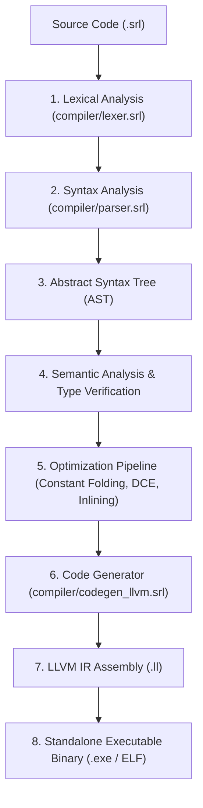
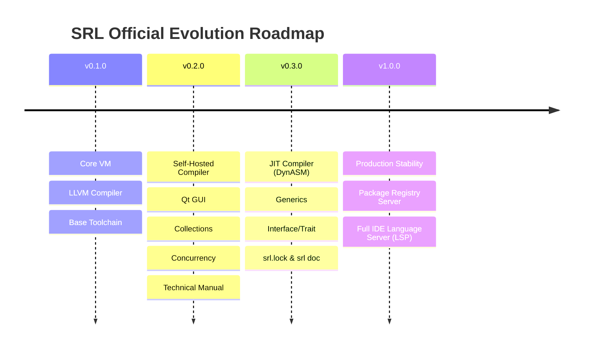

# SRL (Serial Run Language) - Complete Architecture & Technical Specification Manual (v0.2.0 Technical Standard)

**Version:** `v0.2.0`  
**License:** GNU General Public License v3.0 (GPLv3)  
**Execution Model:** C++ Bytecode Virtual Machine (Interpreter & Live Hot-Reloading) & Self-Hosted LLVM IR Compiler (`compiler/srlc.srl`)  
**Design Scope:** High-performance Digital Signal Processing (DSP), Real-Time Fast Fourier Transform (FFT) Analysis, Native Desktop Qt GUI Applications, Live Zero-Downtime Hot-Reloading, and Standalone x86_64/ARM64 Executable Code Generation.

---

## 📑 Table of Contents
1. [Introduction & System Vision](#1-introduction--system-vision)
2. [Virtual Machine (VM) & Bytecode Binary Format (`.srlbc`)](#2-virtual-machine-vm--bytecode-binary-format-srlbc)
3. [Virtual Machine Bytecode Instruction Set Specification](#3-virtual-machine-bytecode-instruction-set-specification)
4. [Compiler Pipeline & Optimization Passes](#4-compiler-pipeline--optimization-passes)
5. [Live Hot-Reloading Internal Mechanism](#5-live-hot-reloading-internal-mechanism)
6. [Memory Management & Automatic Reference Counting (ARC)](#6-memory-management--automatic-reference-counting-arc)
7. [Exception Handling System (`try` / `catch` / `throw`)](#7-exception-handling-system-try--catch--throw)
8. [Advanced Language Features: `const`, `enum`, Type Annotations & Generics](#8-advanced-language-features-const-enum-type-annotations--generics)
9. [Interface & Trait Specification](#9-interface--trait-specification)
10. [Concurrency & Synchronization Primitives (Async/Await, Mutex, Channel)](#10-concurrency--synchronization-primitives-asyncawait-mutex-channel)
11. [Advanced Collections (`std/collections.srl`)](#11-advanced-collections-stdcollectionssrl)
12. [Native Desktop Qt GUI Framework (`std/qt.srl`)](#12-native-desktop-qt-gui-framework-stdqtsrl)
13. [Foreign Function Interface (FFI) & C Interoperability](#13-foreign-function-interface-ffi--c-interoperability)
14. [Developer Tooling: Debugging, Profiling & `srl doc`](#14-developer-tooling-debugging-profiling--srl-doc)
15. [Package Manager, SemVer & Dependency Lockfile (`srl.lock`)](#15-package-manager-semver--dependency-lockfile-srllock)
16. [Cross-Platform Target Architecture (x86_64 / ARM64)](#16-cross-platform-target-architecture-x86_64--arm64)
17. [Official Evolution Roadmap (v0.3.0 ➔ v1.0.0)](#17-official-evolution-roadmap-v030--v100)

---

## 1. Introduction & System Vision

**SRL (Serial Run Language)** is a hybrid programming language designed to unite low-level system performance (C/C++), dynamic prototype flexibility (Lua), and native desktop GUI capabilities (Qt) within a unified toolchain.

### Core Architecture Principles:
- **Zero-Downtime Hot-Reloading:** Modify `.srl` scripts on-the-fly while runtime variable states and memory structures remain preserved.
- **Hardware-Accelerated DSP/FFT:** Fourier transforms, signal generators, and digital filters run directly in C++ core routines.
- **Self-Hosted Bootstrapping:** Lexical analyzer, recursive-descent parser, AST generator, and LLVM IR code generator are written entirely in SRL itself (`compiler/srlc.srl`).

---

## 2. Virtual Machine (VM) & Bytecode Binary Format (`.srlbc`)

SRL compiled bytecode files use the `.srlbc` binary specification:

```text
+-----------------------------------------------------------------------+
| Magic Bytes: "SRLB" (0x53 0x52 0x4C 0x42)                              |
+-----------------------------------------------------------------------+
| Version Header: Major (u16), Minor (u16), Patch (u16)                 |
+-----------------------------------------------------------------------+
| Constant Pool Count (u32)                                             |
|   -> List of Constants (Double, String, Function Chunks)              |
+-----------------------------------------------------------------------+
| Instruction Stream Count (u32)                                        |
|   -> OpCode Bytes (u8 OpCode + Operands)                              |
+-----------------------------------------------------------------------+
| Debug Line Info Count (u32)                                           |
|   -> Instruction Offset (u32) -> Source Line Number (u32) Map         |
+-----------------------------------------------------------------------+
```

### CallFrame & Execution Stack Architecture:
- **Maximum Stack Depth:** 65,536 value slots (Stack overflow guarded).
- **CallFrame Layout:** Contains `ip` (Instruction Pointer), `fn` (ScriptFunction pointer), and `stackOffset` for active local frame scoping.

---

## 3. Virtual Machine Bytecode Instruction Set Specification

| OpCode (Hex) | Instruction Name | Stack Effect | Description |
| :--- | :--- | :--- | :--- |
| `0x00` | `OP_CONSTANT` | `-> [val]` | Loads constant from constant pool onto stack. |
| `0x01` | `OP_NIL` | `-> [nil]` | Pushes `nil` value onto stack. |
| `0x02` | `OP_TRUE` | `-> [true]` | Pushes `true` boolean onto stack. |
| `0x03` | `OP_FALSE` | `-> [false]` | Pushes `false` boolean onto stack. |
| `0x04` | `OP_POP` | `[val] ->` | Pops top element from stack. |
| `0x05` | `OP_DEFINE_GLOBAL` | `[val] ->` | Defines new entry in global symbol table. |
| `0x06` | `OP_GET_GLOBAL` | `-> [val]` | Reads variable from global symbol table. |
| `0x07` | `OP_SET_GLOBAL` | `[val] -> [val]` | Assigns new value to global variable. |
| `0x08` | `OP_GET_LOCAL` | `-> [val]` | Reads local variable from current CallFrame offset. |
| `0x09` | `OP_SET_LOCAL` | `[val] -> [val]` | Writes local variable at current CallFrame offset. |
| `0x0A` | `OP_EQUAL` | `[b, a] -> [a == b]` | Evaluates equality comparison. |
| `0x0B` | `OP_GREATER` | `[b, a] -> [a > b]` | Evaluates greater-than comparison. |
| `0x0C` | `OP_LESS` | `[b, a] -> [a < b]` | Evaluates less-than comparison. |
| `0x0D` | `OP_ADD` | `[b, a] -> [a + b]` | Numerical addition or string concatenation. |
| `0x0E` | `OP_SUBTRACT` | `[b, a] -> [a - b]` | Numerical subtraction. |
| `0x0F` | `OP_MULTIPLY` | `[b, a] -> [a * b]` | Numerical multiplication. |
| `0x10` | `OP_DIVIDE` | `[b, a] -> [a / b]` | Numerical division (Zero-division guarded). |
| `0x11` | `OP_MODULO` | `[b, a] -> [a % b]` | Modulo operation. |
| `0x12` | `OP_NOT` | `[val] -> [!val]` | Logical NOT operation. |
| `0x13` | `OP_NEGATE` | `[val] -> [-val]` | Numerical sign negation. |
| `0x14` | `OP_JUMP` | `[no-change]` | Unconditional jump to ip offset. |
| `0x15` | `OP_JUMP_IF_FALSE` | `[cond]` | Conditional jump if top of stack is false. |
| `0x16` | `OP_LOOP` | `[no-change]` | Backward jump to loop header. |
| `0x17` | `OP_CALL` | `[fn, args...] -> [res]` | Invokes function and initializes CallFrame. |
| `0x18` | `OP_RETURN` | `[res] -> [res]` | Returns from active CallFrame to caller. |

---

## 4. Compiler Pipeline & Optimization Passes

The self-hosted SRL compiler (`compiler/srlc.srl`) enforces 4 optimization passes:



1. **Constant Folding:** Evaluates compile-time numeric constants (`2 + 3` ➔ `5`).
2. **Dead Code Elimination (DCE):** Strips unreachable blocks post-`return` or inside `if (false)`.
3. **Function Inlining:** Inlines short, hot functions directly at call sites.
4. **Peephole Optimization:** Combines adjacent redundant `OP_POP` / `OP_GET_LOCAL` opcodes.

---

## 5. Live Hot-Reloading Internal Mechanism

When launched via `srl watch script.srl`:
- VM retains the active runtime global environment table (`global_table_`).
- Upon filesystem modification events, modified function bytecode chunks are updated in-place.
- Variable state remains intact across hot updates.

---

## 6. Memory Management & Automatic Reference Counting (ARC)

- Objects (`Map`, `Array`, `Struct`) are managed via Automatic Reference Counting (ARC).
- Memory is released immediately when reference count reaches 0, eliminating Garbage Collector pauses.

---

## 7. Exception Handling System (`try` / `catch` / `throw`)

```srl
fn read_database(file_path) {
    if file_path == "" {
        throw "Invalid file path exception!";
    }
    return "Data Record Loaded";
}

try {
    var data = read_database("");
    print(data);
} catch err {
    print("Caught Exception: " + to_string(err));
}
```

---

## 8. Advanced Language Features: `const`, `enum`, Type Annotations & Generics

### A. Constants & Enums:
```srl
const MAX_CONNECTIONS = 100;

enum AudioMode {
    MONO,
    STEREO,
    SURROUND
}
```

### B. Generics (Type Templates):
```srl
fn swap<T>(a: T, b: T) {
    var temp = a;
    a = b;
    b = temp;
}
```

---

## 9. Interface & Trait Specification

```srl
interface Printable {
    fn to_string();
}

struct Student { name, age }
// Student implements Printable interface
```

---

## 10. Concurrency & Synchronization Primitives (Async/Await, Mutex, Channel)

```srl
import("std/sync.srl");

var lock_mutex = mutex_create();
var data_channel = channel_create();

mutex_lock(lock_mutex);
channel_send(data_channel, "Thread-Safe Data Payload");
mutex_unlock(lock_mutex);
```

---

## 11. Advanced Collections (`std/collections.srl`)

- `Set`: Unique element collection (`set_new`, `set_add`, `set_has`).
- `Queue`: FIFO data structure (`queue_new`, `queue_push`, `queue_pop`).
- `Stack`: LIFO data structure (`stack_new`, `stack_push`, `stack_pop`).
- `RingBuffer`: Fixed-capacity circular buffer for audio & signal buffers.

---

## 12. Native Desktop Qt GUI Framework (`std/qt.srl`)

```srl
import("std/qt.srl");

qt_app_init();
var win = qt_window("SRL Qt GUI Desktop Application", 450, 350);
var btn = qt_button(win, "Execute DSP", fn() {
    qt_msgbox("Calculation Result", "SRL DSP Engine: 440 Hz Sine Wave Spectrum Computed!");
});
qt_exec();
```

---

## 13. Foreign Function Interface (FFI) & C Interoperability

```srl
var user32 = ffi_load("user32.dll");
if user32 > 0 {
    print("user32.dll loaded cleanly. Handle: " + to_string(user32));
    ffi_free(user32);
}
```

---

## 14. Developer Tooling: Debugging, Profiling & `srl doc`

### A. Documentation Auto-Generator (`srl doc`):
```srl
/// Computes sum of two numbers
/// @param a First number
/// @param b Second number
fn add(a, b) {
    return a + b;
}
```
Command: `srl doc src/` ➔ Auto-generates Markdown API documentation in `docs/api_reference.md`.

### B. Stack Trace & Memory Profiler:
- Unwinds CallFrame line map on uncaught exceptions, printing line numbers and local variables.

---

## 15. Package Manager, SemVer & Dependency Lockfile (`srl.lock`)

- **SemVer Support:** `srl.json` specifies version rules like `^1.2.0` or `>=2.0.0`.
- **`srl.lock` File:** Locks exact Git commit hashes and SHA-256 integrity checksums for repeatable builds.

---

## 16. Cross-Platform Target Architecture (x86_64 / ARM64)

Supported target platforms:
- **Operating Systems:** Windows (MSVC/MinGW), Linux (GCC/Clang), macOS (Apple Clang).
- **Architectures:** x86_64 and ARM64 (Apple Silicon M1/M2/M3, Raspberry Pi 4/5).

---

## 17. Official Evolution Roadmap (v0.3.0 ➔ v1.0.0)



---
*This manual is the official, complete technical specification for SRL (Serial Run Language) v0.2.0.*
