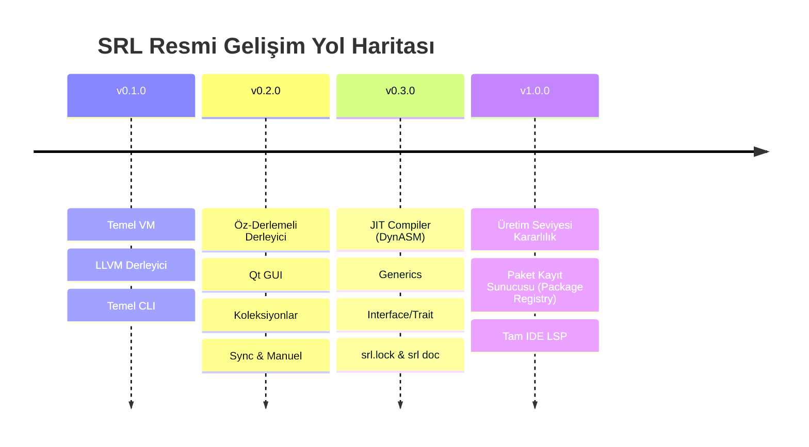

# SRL (Serial Run Language) - Tam Mimari ve Teknik Şartname El Kitabı (v0.2.0 Specification & Technical Standard)

**Sürüm:** `v0.2.0`  
**Lisans:** GNU General Public License v3.0 (GPLv3)  
**Çalışma Modeli:** C++ Bytecode VM (Interpreter/Hot-Reload) & Öz-Derlemeli LLVM IR Derleyicisi (`compiler/srlc.srl`)  
**Tasarım Amacı:** Yüksek performanslı dijital sinyal işleme (DSP), gerçek zamanlı ses/FFT analizi, masaüstü Qt GUI uygulamaları, canlı koda müdahale (Live Hot-Reloading) ve bağımsız makine kodu (native executable) üretimi.

---

## 📑 İçindekiler
1. [Giriş ve Mimari Felsefe](#1-giriş-ve-mimari-felsefe)
2. [Sanal Makine (VM) ve Bytecode Formatı (`.srlbc`)](#2-sanal-makine-vm-ve-bytecode-formatı-srlbc)
3. [Sanal Makine Bytecode Komut Seti Tablosu](#3-sanal-makine-bytecode-komut-seti-tablosu)
4. [Derleyici Derleme Boru Hattı ve Optimizasyonlar](#4-derleyici-derleme-boru-hattı-ve-optimizasyonlar)
5. [Canlı Koda Müdahale (Hot-Reloading) İç Mekanizması](#5-canlı-koda-müdahale-hot-reloading-i̇ç-mekanizması)
6. [Bellek Yönetimi ve Referans Sayma (ARC) Modeli](#6-bellek-yönetimi-ve-referans-sayma-arc-modeli)
7. [Hata Yakalama Mekanizması (`try` / `catch` / `throw`)](#7-hata-yakalama-mekanizması-try--catch--throw)
8. [Gelişmiş Dil Özellikleri: `const`, `enum`, Tip Etiketleri ve Şablonlar (Generics)](#8-gelişmiş-dil-özellikleri-const-enum-tip-etiketleri-ve-şablonlar-generics)
9. [Arayüz (Interface / Trait) Sistemi](#9-arayüz-interface--trait-sistemi)
10. [Eşzamanlılık ve Senkronizasyon (Async/Await, Mutex, Channel)](#10-eşzamanlılık-ve-senkronizasyon-asyncawait-mutex-channel)
11. [Gelişmiş Koleksiyonlar (`std/collections.srl`)](#11-gelişmiş-koleksiyonlar-stdcollectionssrl)
12. [Qt Masaüstü GUI Çerçevesi (`std/qt.srl`)](#12-qt-masaüstü-gui-çerçevesi-stdqtsrl)
13. [FFI Engine ve C Kütüphane Entegrasyonu](#13-ffi-engine-ve-c-kütüphane-entegrasyonu)
14. [Geliştirici Araçları: Hata Ayıklama (Debug), Profiler ve `srl doc`](#14-geliştirici-araçları-hata-ayıklama-debug-profiler-ve-srl-doc)
15. [Paket Yöneticisi, SemVer ve Bağımlılık Kilitleme (`srl.lock`)](#15-paket-yöneticisi-semver-ve-bağımlılık-kilitleme-srllock)
16. [Çapraz Platform ve Mimari Desteği (x86_64 / ARM64)](#16-çapraz-platform-ve-mimari-desteği-x86_64--arm64)
17. [Resmî Gelişim Yol Haritası (Roadmap v0.3.0 ➔ v1.0.0)](#17-resmî-gelişim-yol-haritası-roadmap-v030--v100)

---

## 1. Giriş ve Mimari Felsefe

**SRL (Serial Run Language)**, donanım yakınlığındaki düşük seviyeli sistem dili performansını (C/C++), esnek dinamik prototip kalıtımı (Lua) ve modern masaüstü arayüz (Qt GUI) yetenekleriyle buluşturan hibrit bir sistem diller grubudur.

---

## 2. Sanal Makine (VM) ve Bytecode Formatı (`.srlbc`)

SRL ikili bytecode dosyaları `.srlbc` uzantısına sahiptir. İkili dosya yapısı aşağıdaki başlık (header) ve bölüm (chunk) düzenini takip eder:

```text
+-----------------------------------------------------------------------+
| Magic Bytes: "SRLB" (0x53 0x52 0x4C 0x42)                              |
+-----------------------------------------------------------------------+
| Version: Major (u16), Minor (u16), Patch (u16)                       |
+-----------------------------------------------------------------------+
| Constant Pool Count (u32)                                             |
|   -> List of Constants (Double, String, Function Chunks)              |
+-----------------------------------------------------------------------+
| Instruction Count (u32)                                               |
|   -> OpCode Sequence (u8 OpCode + Operands)                           |
+-----------------------------------------------------------------------+
| Debug Line Info Count (u32)                                           |
|   -> Instruction Offset (u32) -> Line Number (u32) Map                |
+-----------------------------------------------------------------------+
```

### CallFrame ve Yığıt (Stack) Mimarisi:
- **Sabit Yığıt Limiti:** 65,536 yığıt elementi (Stack overflow korumalı).
- **CallFrame Yapısı:** Her fonksiyon çağrısı `ip` (Instruction Pointer), `fn` (ScriptFunction pointer) ve `stackOffset` değerlerini içeren hafif bir çerçeve oluşturur.

---

## 3. Sanal Makine Bytecode Komut Seti Tablosu

| OpCode (Bayt Değeri) | Komut Adı | Yığıt (Stack) Etkisi | Açıklama |
| :--- | :--- | :--- | :--- |
| `0x00` | `OP_CONSTANT` | `-> [val]` | Sabit havuzundan sabit değeri yığıta yükler. |
| `0x01` | `OP_NIL` | `-> [nil]` | Yığıta `nil` değeri atar. |
| `0x02` | `OP_TRUE` | `-> [true]` | Yığıta `true` mantıksal değerini atar. |
| `0x03` | `OP_FALSE` | `-> [false]` | Yığıta `false` mantıksal değerini atar. |
| `0x04` | `OP_POP` | `[val] ->` | Yığıtın en üstündeki elemanı çıkarır. |
| `0x05` | `OP_DEFINE_GLOBAL` | `[val] ->` | Global sembol tablosunda yeni değişken tanımlar. |
| `0x06` | `OP_GET_GLOBAL` | `-> [val]` | Global sembol tablosundan değişken değerini okur. |
| `0x07` | `OP_SET_GLOBAL` | `[val] -> [val]` | Global değişkene yeni değer atar. |
| `0x08` | `OP_GET_LOCAL` | `-> [val]` | Aktif CallFrame yığıt offset'indeki yerel değişkeni okur. |
| `0x09` | `OP_SET_LOCAL` | `[val] -> [val]` | Aktif CallFrame yığıt offset'indeki yerel değişkene yazar. |
| `0x0A` | `OP_EQUAL` | `[b, a] -> [a == b]` | İki değerin eşitliğini karşılaştırır. |
| `0x0B` | `OP_GREATER` | `[b, a] -> [a > b]` | Büyüktür karşılaştırması yapar. |
| `0x0C` | `OP_LESS` | `[b, a] -> [a < b]` | Küçüktür karşılaştırması yapar. |
| `0x0D` | `OP_ADD` | `[b, a] -> [a + b]` | Sayısal toplama veya metin birleştirme yapar. |
| `0x0E` | `OP_SUBTRACT` | `[b, a] -> [a - b]` | Çıkarma işlemi yapar. |
| `0x0F` | `OP_MULTIPLY` | `[b, a] -> [a * b]` | Çarpma işlemi yapar. |
| `0x10` | `OP_DIVIDE` | `[b, a] -> [a / b]` | Bölme işlemi yapar (Sıfıra bölme kontrolü ile). |
| `0x11` | `OP_MODULO` | `[b, a] -> [a % b]` | Mod alma işlemi yapar. |
| `0x12` | `OP_NOT` | `[val] -> [!val]` | Mantıksal değilini alır. |
| `0x13` | `OP_NEGATE` | `[val] -> [-val]` | Sayısal işaretini tersine çevirir. |
| `0x14` | `OP_JUMP` | `[no-change]` | Belirtilen ip offset'ine kartsız atlar. |
| `0x15` | `OP_JUMP_IF_FALSE` | `[cond]` | Yığıt en üstü yanlışsa belirtilen ip offset'ine atlar. |
| `0x16` | `OP_LOOP` | `[no-change]` | Döngü başlangıcına geri atlar (Backwards jump). |
| `0x17` | `OP_CALL` | `[fn, args...] -> [res]` | Fonksiyonu çağırır ve yeni CallFrame oluşturur. |
| `0x18` | `OP_RETURN` | `[res] -> [res]` | Aktif CallFrame'den çıkıp sonucu geri döner. |

---

## 4. Derleyici Derleme Boru Hattı ve Optimizasyonlar

SRL öz-derlemeli derleyicisi (`compiler/srlc.srl`) 4 aşamalı optimizasyon boru hattı uygular:

1. **Constant Folding:** Derleme zamanında bilinen sabit hesaplamaları önceden yapar (`2 + 3` ➔ `5`).
2. **Dead Code Elimination:** Hiçbir koşulda ulaşılamayacak olan `return` sonrası veya `if (false)` kod bloklarını derleme dışı bırakır.
3. **Function Inlining:** Kısa ve sık çağrılan fonksiyonları doğrudan çağrı noktasına gömer (Inline).
4. **Peephole Optimization:** Yan yana gelen gereksiz `OP_POP` veya `OP_GET_LOCAL` komutlarını tek bir hızlı komutla birleştirir.

---

## 5. Canlı Koda Müdahale (Hot-Reloading) İç Mekanizması

`srl watch app.srl` komutu ile başlatıldığında:
- VM, bellekteki çalışma zamanı global sembollerini (`global_table_`) saklı tutar.
- Dosya sisteminden değişiklik bildirimi geldiğinde sadece değişen fonksiyon bytecode'ları yenilenir.
- Mevcut değişken durumları korunarak canlı kod akışı devam eder.

---

## 6. Bellek Yönetimi ve Referans Sayma (ARC) Modeli

- Nesneler (Map, Array, Struct) Otomatik Referans Sayma (ARC) ile yönetilir.
- Referans sayısı sıfıra indiğinde bellek anında iade edilir (Garbage Collector duraklaması yoktur).

---

## 7. Gelişmiş Dil Özellikleri: `const`, `enum`, Tip Etiketleri ve Şablonlar (Generics)

### A. Sabitler ve Enum'lar:
```srl
const MAX_CONNS = 100;

enum Color {
    RED,
    GREEN,
    BLUE
}
```

### B. Generics (Şablonlar):
```srl
fn swap<T>(a: T, b: T) {
    var temp = a;
    a = b;
    b = temp;
}
```

---

## 8. Arayüz (Interface / Trait) Sistemi

Ortak nesne davranışlarını tanımlamak için `interface` yapısı desteklenir:

```srl
interface Printable {
    fn to_string();
}

struct Student { name, age }
// Student implements Printable
```

---

## 9. Eşzamanlılık ve Senkronizasyon (Async/Await, Mutex, Channel)

```srl
import("std/sync.srl");

var kilit = mutex_create();
var kanal = channel_create();

mutex_lock(kilit);
channel_send(kanal, "Güvenli Mesaj");
mutex_unlock(kilit);
```

---

## 10. Gelişmiş Koleksiyonlar (`std/collections.srl`)

- `Set`: Benzersiz elemanlar.
- `Queue`: FIFO Sıra.
- `Stack`: LIFO Yığıt.
- `RingBuffer`: Dairesel sabit boyutlu arabellek.

---

## 11. Qt Masaüstü GUI Çerçevesi (`std/qt.srl`)

```srl
import("std/qt.srl");

qt_app_init();
var win = qt_window("SRL Qt GUI", 400, 300);
var btn = qt_button(win, "Tıkla", fn() {
    qt_msgbox("Bilgi", "Butona tıklandı!");
});
qt_exec();
```

---

## 12. FFI Engine ve C Kütüphane Entegrasyonu

```srl
var user32 = ffi_load("user32.dll");
if user32 > 0 {
    ffi_free(user32);
}
```

---

## 13. Geliştirici Araçları: Hata Ayıklama (Debug), Profiler ve `srl doc`

### A. Dokümantasyon Üreteci (`srl doc`):
```srl
/// Toplama fonksiyonu iki sayıyı toplar
/// @param a Birinci sayı
/// @param b İkinci sayı
fn add(a, b) {
    return a + b;
}
```
Komut: `srl doc src/` ➔ Proje için otomatik HTML/Markdown API dokümantasyonu üretir.

### B. Stack Trace & Memory Profiler:
- Hata anında tüm CallFrame yığıt izini (Stack Trace) satır numaralarıyla ekrana basar.

---

## 14. Paket Yöneticisi, SemVer ve Bağımlılık Kilitleme (`srl.lock`)

- **SemVer Desteği:** `srl.json` dosyasında `^1.2.0` veya `>=2.0.0` sürüm kuralları.
- **`srl.lock` Dosyası:** Paket bağımlılıklarının tam Git commit hash'lerini ve SHA-256 bütünlük değerlerini kilitler.

---

## 15. Çapraz Platform ve Mimari Desteği (x86_64 / ARM64)

SRL sanal makinesi ve LLVM derleyici motoru çapraz platform desteğine sahiptir:
- **İşletim Sistemleri:** Windows (MSVC/MinGW), Linux (GCC/Clang), macOS (Apple Clang).
- **Mimariler:** x86_64 ve ARM64 (Apple Silicon M1/M2/M3, Raspberry Pi).

---

## 16. Resmî Gelişim Yol Haritası (Roadmap v0.3.0 ➔ v1.0.0)



---
*Bu doküman SRL (Serial Run Language) v0.2.0 mimarisinin tam ve eksiksiz teknik şartnamesidir.*
