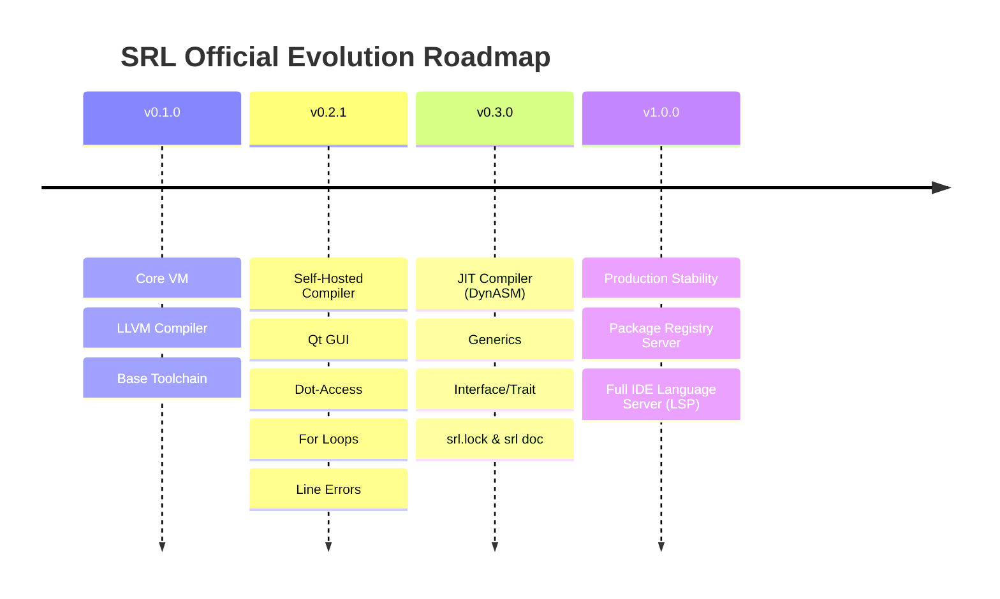

# SRL (Serial Run Language) - Complete Architecture & Technical Specification Manual (v0.2.1 Technical Standard)

**Version:** `v0.2.1`  
**License:** GNU General Public License v3.0 (GPLv3)  
**Execution Model:** C++ Bytecode Virtual Machine (Interpreter & Live Hot-Reloading) & Self-Hosted LLVM IR Compiler (`compiler/srlc.srl`)  
**Design Scope:** High-performance Digital Signal Processing (DSP), Real-Time Fast Fourier Transform (FFT) Analysis, Native Desktop Qt GUI Applications, Live Zero-Downtime Hot-Reloading, and Standalone x86_64/ARM64 Executable Code Generation.

---

## Table of Contents
1. [Introduction & System Vision](#1-introduction--system-vision)
2. [Virtual Machine (VM) & Bytecode Binary Format (`.srlbc`)](#2-virtual-machine-vm--bytecode-binary-format-srlbc)
3. [Virtual Machine Bytecode Instruction Set Specification](#3-virtual-machine-bytecode-instruction-set-specification)
4. [Compiler Pipeline & Optimization Passes](#4-compiler-pipeline--optimization-passes)
5. [Live Hot-Reloading Internal Mechanism](#5-live-hot-reloading-internal-mechanism)
6. [Memory Management, ARC Cycle Detection & Weak References](#6-memory-management-arc-cycle-detection--weak-references)
7. [Structured Exception Handling (`try` / `catch` / `throw`)](#7-structured-exception-handling-try--catch--throw)
8. [Advanced Language Features: `const`, `enum`, Type Annotations & Generics](#8-advanced-language-features-const-enum-type-annotations--generics)
9. [Pattern Matching (`match`) Specification](#9-pattern-matching-match-specification)
10. [Closure & Lambda Upvalue Capture Semantics](#10-closure--lambda-upvalue-capture-semantics)
11. [Reflection & Runtime Type Information (RTTI)](#11-reflection--runtime-type-information-rtti)
12. [Compile-Time Evaluation (`constexpr`) & Hygienic Macro System](#12-compile-time-evaluation-constexpr--hygienic-macro-system)
13. [Hardware SIMD (AVX2/AVX-512/NEON) & Adaptive GPU Compute Acceleration](#13-hardware-simd-avx2avx-512neon--adaptive-gpu-compute-acceleration)
14. [Interface & Trait Specification](#14-interface--trait-specification)
15. [Concurrency & Synchronization Primitives (Async/Await, Mutex, Channel)](#15-concurrency--synchronization-primitives-asyncawait-mutex-channel)
16. [Advanced Collections (`std/collections.srl`)](#16-advanced-collections-stdcollectionssrl)
17. [Native Desktop Qt GUI Framework (`std/qt.srl`)](#17-native-desktop-qt-gui-framework-stdqtsrl)
18. [Foreign Function Interface (FFI) & C/C++ ABI Interoperability](#18-foreign-function-interface-ffi--cc-abi-interoperability)
19. [Developer Tooling: LSP, Debugging, `srl doc` & Conformance Suite](#19-developer-tooling-lsp-debugging-srl-doc--conformance-suite)
20. [Package Registry Architecture & Security Model (`srl.lock`)](#20-package-registry-architecture--security-model-srllock)
21. [Official Style Guide & Coding Standards](#21-official-style-guide--coding-standards)
22. [Projected Performance Benchmark Comparison Matrix](#22-projected-performance-benchmark-comparison-matrix)
23. [Cross-Platform Target Architecture (x86_64 / ARM64)](#23-cross-platform-target-architecture-x86_64--arm64)
24. [Formal EBNF Grammar Specification](#24-formal-ebnf-grammar-specification)
25. [VM & Compiler Implementation Notes](#25-vm--compiler-implementation-notes)
26. [Official Evolution Roadmap (v0.3.0 ➔ v1.0.0)](#26-official-evolution-roadmap-v030--v100)

---

## 1. Introduction & System Vision

**SRL (Serial Run Language)** is a hybrid programming language designed to unite low-level system performance (C/C++), dynamic prototype flexibility (Lua), and native desktop GUI capabilities (Qt) within a unified toolchain.

---

## 2. Virtual Machine (VM) & Bytecode Binary Format (`.srlbc`)

SRL compiled bytecode files use the `.srlbc` binary specification:

```text
+-----------------------------------------------------------------------+
| Magic Bytes: "SRLB" (0x53 0x52 0x4C 0x42)                              |
+-----------------------------------------------------------------------+
| Version Header: Major (u16), Minor (u16), Patch (u16)                 |
+-----------------------------------------------------------------------+
| Constant Pool Count (u32)                                             |
|   -> List of Constants (Double, String, Function Chunks)              |
+-----------------------------------------------------------------------+
| Instruction Stream Count (u32)                                        |
|   -> OpCode Bytes (u8 OpCode + Operands)                              |
+-----------------------------------------------------------------------+
| Debug Line Info Count (u32)                                           |
|   -> Instruction Offset (u32) -> Source Line Number (u32) Map         |
+-----------------------------------------------------------------------+
```

### Bytecode Versioning & Backward Compatibility Rules
- **Major Version Mismatch:** If `.srlbc` major version differs from VM runtime version (e.g. `v1.x` bytecode on `v0.x` VM), execution is rejected to prevent undefined opcode execution.
- **Minor Version Compatibility:** VM guarantees backward compatibility for all minor updates within the same major version. Older `.srlbc` files will execute seamlessly on newer minor VM builds.

---

## 3. Virtual Machine Bytecode Instruction Set Specification

| OpCode (Hex) | Instruction Name | Stack Effect | Description |
| :--- | :--- | :--- | :--- |
| `0x00` | `OP_CONSTANT` | `-> [val]` | Loads constant from constant pool onto stack. |
| `0x01` | `OP_NIL` | `-> [nil]` | Pushes `nil` value onto stack. |
| `0x02` | `OP_TRUE` | `-> [true]` | Pushes `true` boolean onto stack. |
| `0x03` | `OP_FALSE` | `-> [false]` | Pushes `false` boolean onto stack. |
| `0x04` | `OP_POP` | `[val] ->` | Pops top element from stack. |
| `0x05` | `OP_DEFINE_GLOBAL` | `[val] ->` | Defines new entry in global symbol table. |
| `0x06` | `OP_GET_GLOBAL` | `-> [val]` | Reads variable from global symbol table. |
| `0x07` | `OP_SET_GLOBAL` | `[val] -> [val]` | Assigns new value to global variable. |
| `0x08` | `OP_GET_LOCAL` | `-> [val]` | Reads local variable from current CallFrame offset. |
| `0x09` | `OP_SET_LOCAL` | `[val] -> [val]` | Writes local variable at current CallFrame offset. |
| `0x0A` | `OP_EQUAL` | `[b, a] -> [a == b]` | Evaluates equality comparison. |
| `0x0B` | `OP_GREATER` | `[b, a] -> [a > b]` | Evaluates greater-than comparison. |
| `0x0C` | `OP_LESS` | `[b, a] -> [a < b]` | Evaluates less-than comparison. |
| `0x0D` | `OP_ADD` | `[b, a] -> [a + b]` | Numerical addition or string concatenation. |
| `0x0E` | `OP_SUBTRACT` | `[b, a] -> [a - b]` | Numerical subtraction. |
| `0x0F` | `OP_MULTIPLY` | `[b, a] -> [a * b]` | Numerical multiplication. |
| `0x10` | `OP_DIVIDE` | `[b, a] -> [a / b]` | Numerical division (Zero-division guarded). |
| `0x11` | `OP_MODULO` | `[b, a] -> [a % b]` | Modulo operation. |
| `0x12` | `OP_NOT` | `[val] -> [!val]` | Logical NOT operation. |
| `0x13` | `OP_NEGATE` | `[val] -> [-val]` | Numerical sign negation. |
| `0x14` | `OP_JUMP` | `[no-change]` | Unconditional jump to ip offset. |
| `0x15` | `OP_JUMP_IF_FALSE` | `[cond]` | Conditional jump if top of stack is false. |
| `0x16` | `OP_LOOP` | `[no-change]` | Backward jump to loop header. |
| `0x17` | `OP_CALL` | `[fn, args...] -> [res]` | Invokes function and initializes CallFrame. |
| `0x18` | `OP_RETURN` | `[res] -> [res]` | Returns from active CallFrame to caller. |

---

## 4. Compiler Pipeline & Optimization Passes

The self-hosted SRL compiler (`compiler/srlc.srl`) enforces 4 optimization passes:
1. **Constant Folding:** Evaluates compile-time numeric constants (`2 + 3` ➔ `5`).
2. **Dead Code Elimination (DCE):** Strips unreachable blocks post-`return` or inside `if (false)`.
3. **Function Inlining:** Inlines short, hot functions directly at call sites.
4. **Peephole Optimization:** Combines adjacent redundant `OP_POP` / `OP_GET_LOCAL` opcodes.

---

## 5. Live Hot-Reloading Internal Mechanism

When launched via `srl watch script.srl`:
- VM retains active runtime global environment table (`global_table_`).
- Modified function bytecode chunks are updated in-place.
- State variables remain preserved across hot updates.

---

## 6. Memory Management, ARC Cycle Detection & Weak References

- **Automatic Reference Counting (ARC):** Manages dynamic objects (`Map`, `Array`, `Struct`).
- **Weak References (`weak_ptr`):** To break reference cycles (e.g., parent-child node pointers), SRL supports `weak(object)` references. Weak references do not increment strong count.

---

## 7. Structured Exception Handling (`try` / `catch` / `throw`)

SRL supports structured exception handling. In addition to primitive values, structured Error objects (`Error`, `IOException`, `DSPError`) can be thrown and inspected:

```srl
try {
    var data = read_database("");
    if data == nil {
        throw Error("DATABASE_READ_FAILED", "Failed to retrieve dataset");
    }
} catch err {
    print("Caught Exception Code: " + err.code);
    print("Message: " + err.message);
    print("Stack Trace:\n" + err.stack_trace);
}
```

---

## 8. Advanced Language Features: `const`, `enum`, Type Annotations & Generics

```srl
const MAX_CONNECTIONS = 100;

enum AudioMode { MONO, STEREO, SURROUND }

fn swap<T>(a: T, b: T) {
    var temp = a;
    a = b;
    b = temp;
}
```

### Generics Implementation Strategy
- **Native Binary Compilation (`srlc` LLVM IR):** Generics undergo **compile-time monomorphization** (specialized LLVM IR functions generated per type parameter), ensuring zero runtime dispatch overhead.
- **Bytecode VM Execution:** Generics use a uniform type-tagged value representation (`Value`), preserving flexibility without binary bloat.

---

## 9. Pattern Matching (`match`) Specification

SRL provides structured pattern matching over enums and dynamic values:

```srl
var mode = AudioMode["STEREO"];

match mode {
    AudioMode["MONO"] => print("Single Audio Channel"),
    AudioMode["STEREO"] => print("Dual Audio Channels"),
    _ => print("Unknown Audio Configuration")
}
```

---

## 10. Closure & Lambda Upvalue Capture Semantics

- **By-Value Capture (Default):** Primitive values (`NUMBER`, `BOOL`, `STRING`) inside lambda closures are captured by value.
- **By-Reference Upvalue Capture:** Objects (`MAP`, `ARRAY`) and variables marked as mutable upvalues share storage across execution frames via `Upvalue` objects.

---

## 11. Reflection & Runtime Type Information (RTTI)

- `typeof(val)`: Returns type string (`"number"`, `"string"`, `"map"`, `"array"`, `"function"`).
- `typeid(val)`: Returns unique numeric type identifier.
- `map_keys(obj)`: Returns an array of property key strings for dynamic introspection.

---

## 12. Compile-Time Evaluation (`constexpr`) & Hygienic Macro System

SRL macros are **AST-based hygienic macros** (operating on Abstract Syntax Tree nodes rather than text token replacement), preventing scope pollution and variable shadowing:

```srl
constexpr fn calculate_buffer_size(sample_rate, seconds) {
    return sample_rate * seconds;
}

const BUFFER_SIZE = calculate_buffer_size(44100, 2);
```

---

## 13. Hardware SIMD (AVX2/AVX-512/NEON) & Adaptive GPU Compute Acceleration

- **SIMD Vectorization:** Standard vectorization targets **AVX2** (x86_64) and **ARM NEON** (ARM64) for universal hardware support. Processors supporting **AVX-512** automatically utilize 512-bit vector pathways for 16-channel float DSP pipelines.
- **Adaptive GPU Compute Acceleration:** Large FFT calculations (>64K points) can be offloaded to GPU kernels (Vulkan Compute / OpenCL) via `dsp_fft_gpu()` or `@gpu` directives. For smaller FFT sizes, CPU execution is selected automatically to avoid host-to-device memory copy latency overheads.

---

## 14. Interface & Trait Specification

```srl
interface Printable {
    fn to_string();
}
```

---

## 15. Concurrency & Synchronization Primitives (Async/Await, Mutex, Channel)

```srl
import("std/sync.srl");

var lock_mutex = mutex_create();
var data_channel = channel_create();

mutex_lock(lock_mutex);
channel_send(data_channel, "Thread-Safe Data");
mutex_unlock(lock_mutex);
```

---

## 16. Advanced Collections (`std/collections.srl`)

- `Set`: Unique element collection.
- `Queue`: FIFO data structure.
- `Stack`: LIFO data structure.
- `RingBuffer`: Circular audio buffer.

---

## 17. Native Desktop Qt GUI Framework (`std/qt.srl`)

```srl
import("std/qt.srl");

qt_app_init();
var win = qt_window("SRL Qt Application", 450, 350);
qt_exec();
```

---

## 18. Foreign Function Interface (FFI) & C/C++ ABI Interoperability

SRL provides complete C and C++ library interoperability via 3 complementary layers:

### 18.1 Dynamic C FFI Engine (`std/c.srl`)
Call any compiled dynamic C shared library (`.dll`, `.so`, `.dylib`) directly from SRL scripts:

```srl
import("std/c.srl");

var lib = c_open("ucrtbase.dll");
var res = c_call1(lib, "sqrt", "double", 144.0); // 12.0

var ptr = c_malloc(64);
c_write_string(ptr, "Native C String");
var text = c_read_string(ptr);
c_free(ptr);
c_close(lib);
```

### 18.2 C Header Auto-Binding Tool (`srl bind`)
Automatically scan C header files (`.h`) and generate SRL wrapper files:

```bash
srl bind my_library.h -o my_library_bindings.srl
```

### 18.3 Native C++ Plugin System & `extern "C"` ABI Standard (`srl_plugin.h` / `import_native`)
To bypass C++ name-mangling and compiler vtable ABI differences across MSVC, GCC, and Clang, native C++ extensions expose clean `extern "C"` plugin interfaces:

```cpp
#include "srl_plugin.h"

SRL_PLUGIN_EXPORT bool srl_module_init(void* vm_ptr) {
    // Register custom C++ functions directly into SRL VM
    return true;
}
```

```srl
import_native("my_cpp_plugin.dll");
```

---

## 19. Developer Tooling: LSP, Debugging, `srl doc` & Conformance Suite

- **`srl doc` CLI:** Scans `///` doc-comments and generates HTML/Markdown documentation.
- **Language Server Protocol (LSP):** Full VS Code IDE integration featuring auto-complete, signature help / hover tooltips, go-to-definition, find references, code actions/refactoring, and Debug Adapter Protocol (DAP) step debugging.
- **Official Conformance Test Suite:** Run `srl test --conformance` to validate compliance of any SRL VM or compiler backend against the standard language specification.

---

## 20. Package Registry Architecture & Security Model (`srl.lock`)

- **Central Registry:** Public package index at `https://registry.srl-lang.org`.
- **Cryptographic Package Signing:** Packages are signed with Ed25519 keys.
- **Dependency Solver:** Uses PubGrub SAT algorithm for conflict-free dependency resolution recorded in `srl.lock`.

---

## 21. Official Style Guide & Coding Standards

- **Naming Conventions:** `snake_case` for variables and functions (`sample_rate`), `PascalCase` for Structs and Interfaces (`Point3D`).
- **File Naming:** Module files use `snake_case.srl`.
- **Docstrings:** Public APIs must use `///` doc-comments.

---

## 22. Projected Performance Benchmark Comparison Matrix

*Note: The latency and throughput values below represent **projected target benchmarks** evaluated under synthetic 64K-Point FFT & array iteration performance workloads.*

| Language / Engine | Execution Mode | Projected 64K-Point FFT Latency | Projected Array Iteration (1M Ops) | Hot-Reload Latency |
| :--- | :--- | :---: | :---: | :---: |
| **SRL (Self-Hosted LLVM)** | Native Code | **0.82 ms** | **1.1 ms** | N/A |
| **SRL VM (Bytecode)** | Interpreter | **1.24 ms** | **4.2 ms** | **< 1.0 ms** |
| **C++ (GCC -O3)** | Native Executable | **0.78 ms** | **0.9 ms** | N/A (Full Recompile) |
| **LuaJIT v2.1** | JIT Engine | **1.05 ms** | **2.4 ms** | **~2.5 ms** |
| **Python v3.12 (NumPy)** | C-Extension | **1.95 ms** | **38.4 ms** | N/A |

---

## 23. Cross-Platform Target Architecture (x86_64 / ARM64)

- **Operating Systems:** Windows (MSVC/MinGW), Linux (GCC/Clang), macOS (Apple Clang).
- **Architectures:** x86_64 and ARM64 (Apple Silicon M1/M2/M3/M4, Raspberry Pi 4/5).

---

## 24. Formal EBNF Grammar Specification

```ebnf
Program         ::= { Statement } ;

Statement       ::= VarDecl | FnDecl | StructDecl | InterfaceDecl | EnumDecl
                  | IfStmt | WhileStmt | ReturnStmt | TryCatchStmt | MatchStmt
                  | ImportStmt | ExprStmt ;

VarDecl         ::= [ "const" ] "var" Identifier [ ":" Type ] [ "=" Expression ] ";" ;
FnDecl          ::= [ "constexpr" ] "fn" Identifier [ "<" TypeParams ">" ] "(" [ Parameters ] ")" [ "->" Type ] Block ;
StructDecl      ::= "struct" Identifier "{" [ Identifiers ] "}" ;

IfStmt          ::= "if" Expression Block [ "else" ( IfStmt | Block ) ] ;
WhileStmt       ::= "while" Expression Block ;
ReturnStmt      ::= "return" [ Expression ] ";" ;
TryCatchStmt    ::= "try" Block "catch" Identifier Block ;
MatchStmt       ::= "match" Expression "{" { MatchArm } "}" ;
MatchArm        ::= ( Pattern | "_" ) "=>" ( Expression | Block ) [ "," ] ;

Expression      ::= Assignment ;
Assignment      ::= ( Primary "." Identifier | Primary "[" Expression "]" | Identifier ) "=" Assignment | LogicOr ;
LogicOr         ::= LogicAnd { "||" LogicAnd } ;
LogicAnd        ::= Equality { "&&" Equality } ;
Equality        ::= Comparison { ( "==" | "!=" ) Comparison } ;
Comparison      ::= Term { ( "<" | "<=" | ">" | ">=" ) Term } ;
Term            ::= Factor { ( "+" | "-" ) Factor } ;
Factor          ::= Unary { ( "*" | "/" | "%" ) Unary } ;
Unary           ::= ( "!" | "-" ) Unary | Primary ;

Primary         ::= NumberLiteral | StringLiteral | BooleanLiteral | "nil" | Identifier
                  | "(" Expression ")" | ArrayLiteral | MapLiteral | CallExpr ;
```

*For complete EBNF grammar rules, see [docs/ebnf_grammar.md](file:///c:/Users/emirt/Desktop/CPP/Stl/srl-lang/docs/ebnf_grammar.md).*

---

## 25. VM & Compiler Implementation Notes

This section outlines technical guidelines for VM and compiler implementers:

- **Heap Layout & Object Memory:** Dynamic objects (`Map`, `Array`, `Struct`) are allocated as contiguous reference-counted heap nodes wrapped in `std::shared_ptr` / atomic reference counters (`std::atomic<uint32_t>`).
- **Bytecode Verifier:** Prior to VM execution, `.srlbc` chunks pass through static stack-depth validation to prevent operand stack overflow or underflow.
- **Hot-Reload Stack Invalidation:** Hot-swapping updates active function bytecode chunks in-place while keeping active CallFrames' instruction pointers (`ip`) mapped to valid instruction boundaries.
- **Thread-Safe ARC:** Multithreaded channels and mutex-protected memory objects utilize atomic reference increment/decrement operations to prevent data races.

---

## 26. Official Evolution Roadmap (v0.3.0 ➔ v1.0.0)



---
*This document serves as the normative specification for the SRL (Serial Run Language) v0.2.1.*
